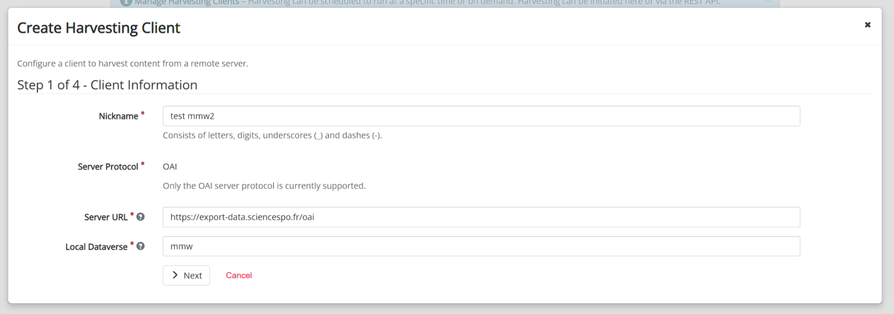
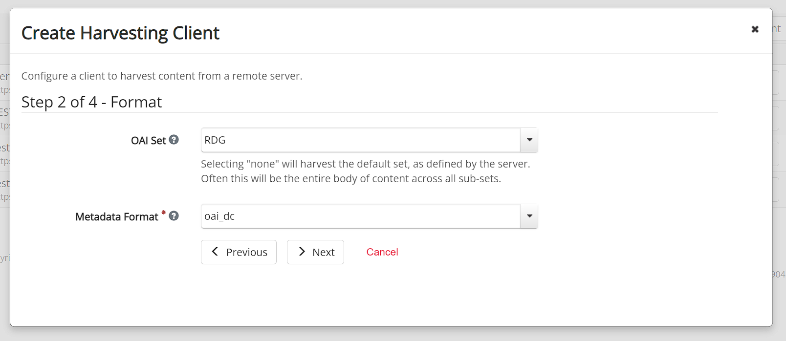
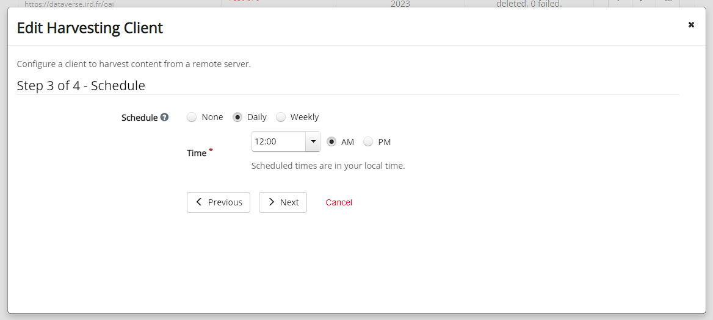
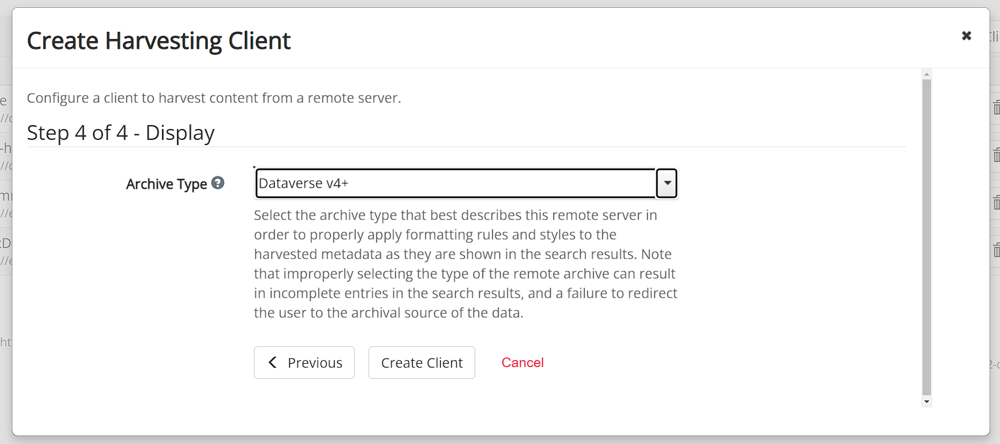
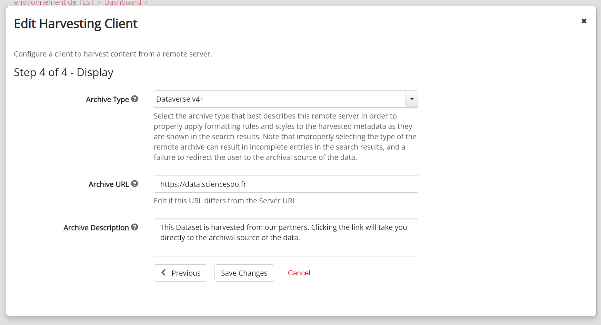

# Dataverse + metadata-middleware

Here is an example of a Dataverse harvesting client configuration to harvest [data.sciencespo](https://data.sciencespo.fr) using [metadata-middleware](https://github.com/CDSP-SCPO/metadata-middleware).

To start, go to your Dataverse dashboard to create a new harvesting client.

## Configuration of the harvesting client

### Step 1 - Client information

- Server URL: the URL to the metadata-middleware instance (here <https://export-data.sciencespo.fr/oai>
- Local dataverse: the collection that will host harvested datasets

### Step 2 - Format

- OAI set: the OAI set to use for the harvesting (here the “RDG” set)
- Metadata format: oai_dc

### Step 3 - Schedule

- Schedule: it depends on your needs and how frequent are your dataset creations and updates (here daily)

### Step 4 - Display

- Archive type: Dataverse 4+

Then click on “Create Client”, edit the client again, go to the last page (click on next until step 4 of 4). New archive fields will appear:

- Archive URL: the URL that hosts the datasets. By default it uses the server URL (metadata-middleware instance URL) but that is not what we want. We want to use the Dataverse URL (here <https://data.sciencespo.fr>)

Save and you are good to go.
